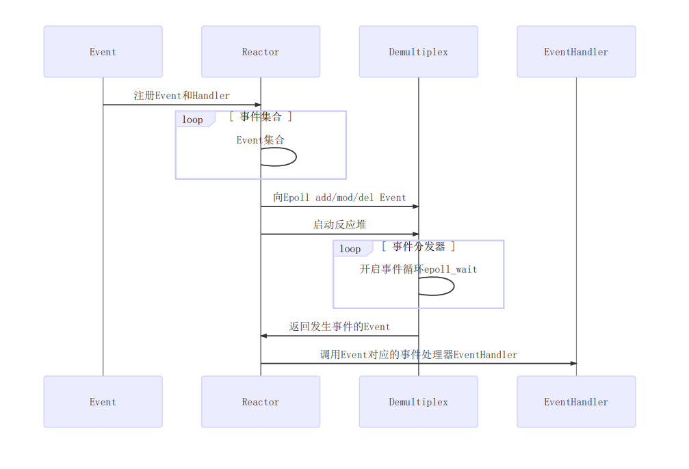
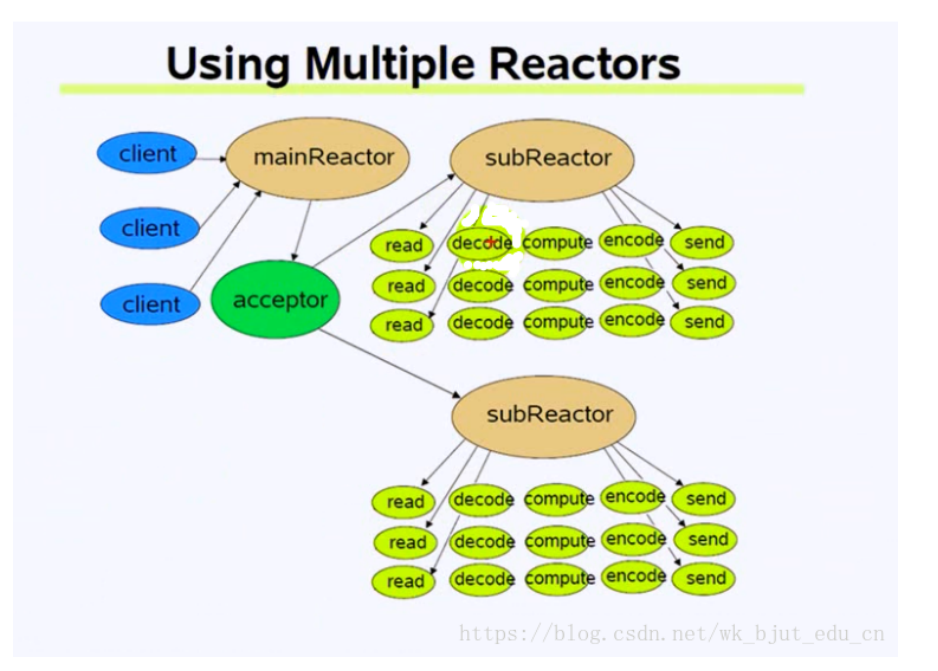

# mymuduo

## 项目描述

参考muduo网络库源码，使用C++11重写muduo网络库中的TcpServer核心代码

## 开发环境

- Linux version 3.10.0（CentOS 7.9 64位）
- gcc version 4.8.5
- cmake version 2.8.12.2

## 编译

```shell
# 项目编译执行即可 头文件生成至目录/usr/include/mymuduo/，.so库文件生成至目录/usr/lib/
sudo ./autobuild.sh

# 测试用例进入example/文件夹，make即可生成服务器测试用例,测试用例默认使用地址为127.0.0.1，端口为8000
cd ./example
make
./testserver

```

## 功能介绍：

1. `TcpServer.*`、`TcpConnection.*`、`Acceptor.*`、`Socket.*`等是`mainloop`对网络连接的响应并轮询分发至各个`subloop`的实现，其中注册大量回调函数
2. `Buffer.*`为`muduo`网络库自行设计的自动扩容的缓冲区，保证数据有序性到达
3. `EventLoop.*`、`Channel.*`、`Poller.*`、`EPollPoller.*`等主要用于事件轮询检测，并实现了事件分发处理的底层实现方法。`EventLoop`负责轮询执行`Poller`，要进行读、写、错误、关闭等事件时需执行哪些回调函数，均绑定至`Channel`中，只需从中调用即可，事件发生后进行相应的回调处理即可
4. `Thread.*`、`EventLoopThread.*`、`EventLoopThreadPool.*`等将线程和`EventLoop`事件轮询绑定在一起，实现真正意义上的`one loop per thread`

## mymuduo网络库的核心代码模块

### Reactor模型

### 

### Channel

------

Channel理解为通道，封装了sockfd和其感兴趣的event，例如EPOLLIN、EPOLLOUT事件，还绑定了poller返回的具体事件,注册到Poller的channelmap中，还有其回调函数对象，sockfd就是要往epoll上注册的文件描述符。总共有两种channel，listenfd->acceptorChannel，connfd->connectionChannel。回调函数对应着事件处理器EventHandler。

### Poller和EPollPoller

------

Poller和EPollPoller对应着Reactor模型中的Demultiplex事件分发器。

Poller : map的key:sockfd value:channel所属的channel通道类型，可以通过sockfd找到channel来调用相应的回调函数。

EPollPoller:重写基类Poller的抽象方法，将channel上的Event事件注册和更新到epoll树上，开启事件循环epoll_wait。

### EventLoop

------

EventLoop对应着Reactor模型中的Reactor反应堆

Reactor反应堆含有channel列表、wakeupFd、wakeupFdChannel。一个wakeupFd对应着一个loop，每一个wakeupFd封装成了wakeupChannel注册到Demultiplex事件分发器。要想唤醒线程可以通过loop对象获取wakeFd，往wakeFd写一点东西就可以唤醒阻塞线程。

### Thread和EventLoopThread

------

EventLoopThread对应着事件线程

### EventLoopThreadPool

------

EventLoopThreadPool为事件循环线程池，可以通过轮询算法获取下一个subloop，如果没有设置线程数量就只会调用baseLoop

一个线程对应着一个loop -> one loop per thread

### Socket

------

封装socket fd

### Acceptor

------

主要封装了listenfd相关的操作 socket bind listen 发生在 baseLoop

### Buffer

------

缓冲区 应用写数据 -> 缓冲区 -> Tcp发送缓冲区 -> send

### TcpConnection

------

一个连接成功的客户端对应一个TcpConnection 封装了Socket，Channel，各种回调，发送和接收缓冲区

### TcpServer

------

封装了Acceptor，EventLoopThreadPool，ConnectionMap。

### muduo使用的模型



以testserver.cpp中的main为例

```c++
/*EchoServer server(&loop, addr, "EchoServer-01")->调用TcpServer::TcpServer(...)构造函数，而构造函数中的acceptor_(new Acceptor(loop, listenAddr, option == kReusePort))设置了listenfd,bind，setsockoption，setReadCallback(std::bind(&Acceptor::handleRead, this)),listenfd有事件发生了，就是有新用户连接了,调用回调函数(TcpServer::newConnection)，通过轮询算法，选择一个subloop，来管理channel，根据连接成功的sockfd，创建TcpConnection（Tcp的构造对象会创建channel，并设置相关的回调函数）连接对象，然后再通过runInLoop，向poller注册channel的epollin事件。

server.start()->启动底层的loop线程池(根据用户设置的线程数，当线程数为0时由mainLoop运行)->创建loop子线程并开启loop.loop(),loop_>runInLoop(std::bind(&Acceptor::listen, acceptor_.get()))->连接到来时，把acceptorChannel注册到baseLoop上，开启baseLoop.loop()(loop中可以一直执行不让程序结束)

loop.loop()(// 启动mainLoop的底层Poller)

*/
```

